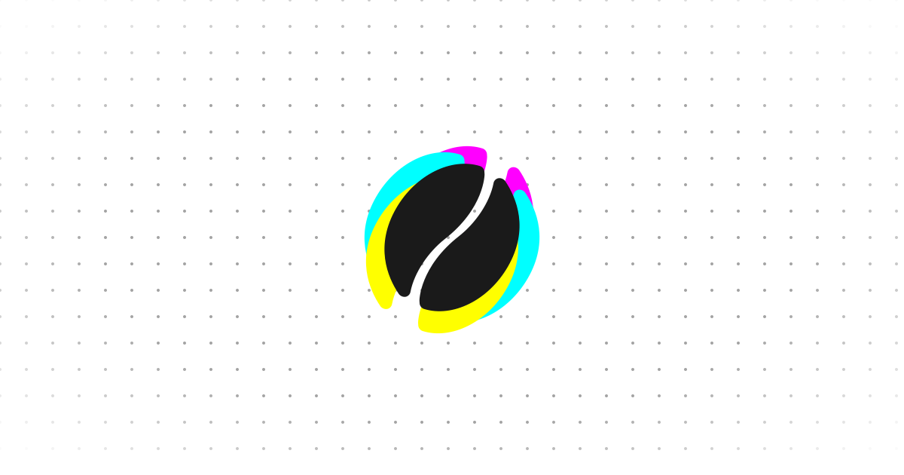

<p align="center">
  
</p>

# Brewlingo

A coffee vocabulary and recipe reference app for baristas.

**[View Live Site](https://avshyz.github.io/brewlingo/)**

## Features

- **Tasting Language** - Vocabulary guide with 10 categories: Aromatics, Clarity, Vibrancy, Acidity, Sweetness, Body, Definition, Structure, Finish, Aftertaste
- **Recipe Baselines** - Pourover brewing parameters by altitude, processing method, and roast level

## Tech Stack

- Vite 6
- Three.js + GSAP
- View Transitions API
- CSS custom properties

## Development

```bash
npm install
npm run dev      # http://localhost:5173
npm run build    # Build to dist/
```
